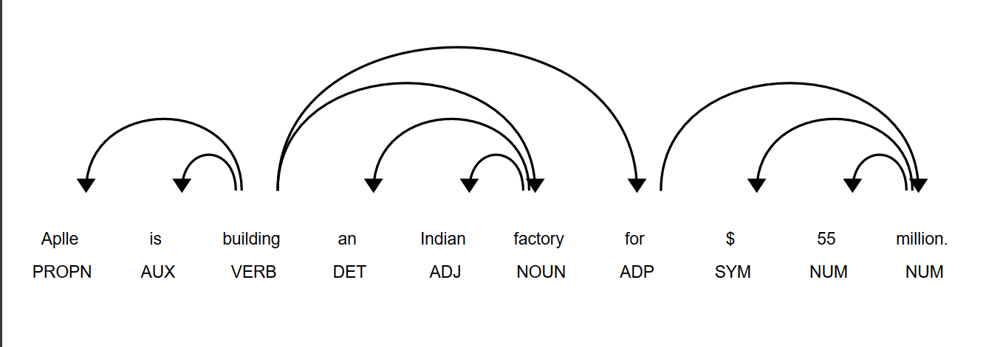

# Basic-NLP-operations
Basic files to understand spacy and nltk libraries

SPACY is a very useful library in python which can be easily used for nlp applications.

This is how it can remove relations between words:

